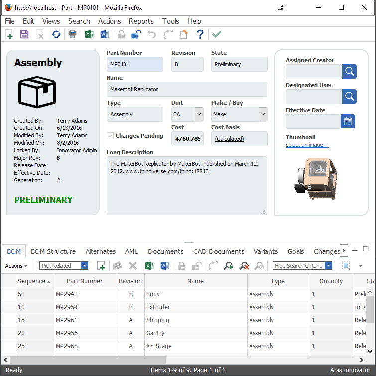
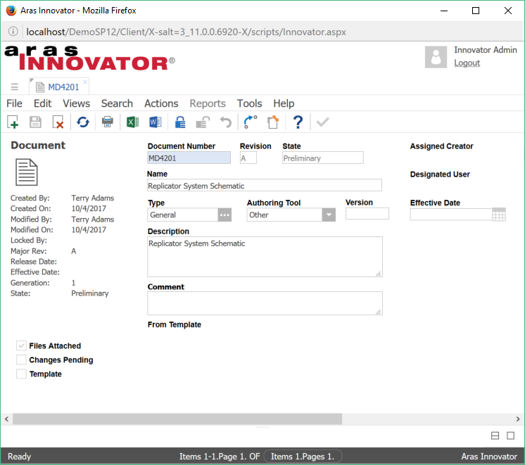
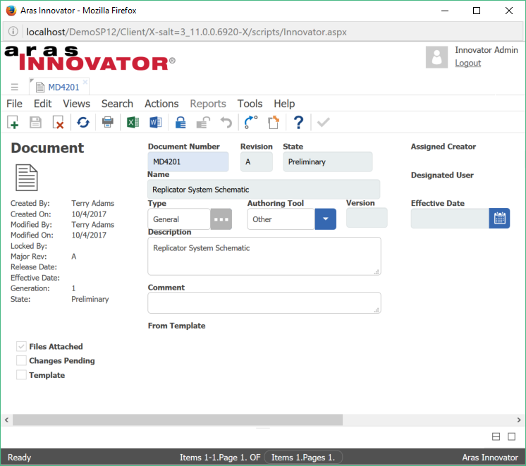
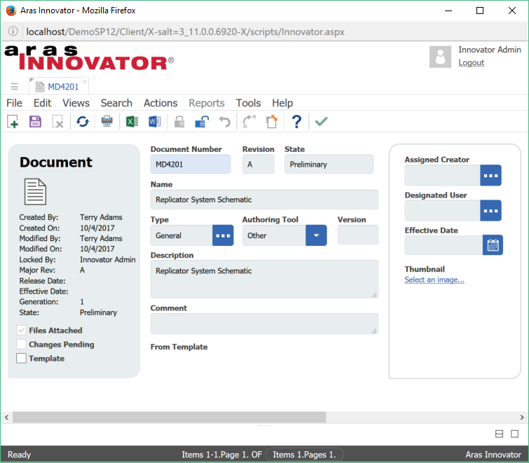

# Custom Form CSS

This project demonstrates how to customize form field appearance with custom CSS.

## How It Works

This project contains two parts - a code tree overlay and an import package. The code tree overlay adds a custom CSS file and several SVG files to the `Innovator\Client\customer` folder. (It is always recommended to store any custom or third party files in the customer folder.)

The import package updates the Part form properties to use the custom CSS file added by the code tree overlay. It also adds a Form Event method to override some of the default CSS classes.

## History

Release | Notes
--------|--------
[v2.0.0](https://github.com/ArasLabs/custom-form-css/releases/tag/v2.0.0) | Updated to support Aras 11 SP12 and 11 SP14. The introduction of type-ahead functionality changed certain client controls, so we updated the javascript and CSS used to style these fields.
[v1.2](https://github.com/ArasLabs/custom-form-css/releases/tag/v1.2) | Custom JavaScript function definitions migrated from Field script tags to the labs_StyleForm Form Event.
[v1.1](https://github.com/ArasLabs/custom-form-css/releases/tag/v1.1) | Code refactored to separate content and presentation.
[v1.0](https://github.com/ArasLabs/custom-form-css/releases/tag/v1.0) | Initial release.

#### Supported Aras Versions

Project | Aras
--------|------
[v2.0.0](https://github.com/ArasLabs/custom-form-css/releases/tag/v2.0.0) | 11.0 SP12, 11.0 SP14
[v1.2](https://github.com/ArasLabs/custom-form-css/releases/tag/v1.2) | 11.0 SP9, 11.0 SP7, 11.0 SP5
[v1.1](https://github.com/ArasLabs/custom-form-css/releases/tag/v1.1) | 11.0 SP7, 11.0 SP5
[v1.0](https://github.com/ArasLabs/custom-form-css/releases/tag/v1.0) | 11.0 SP7, 11.0 SP5

## Installation

#### Important!
**Always back up your code tree and database before applying an import package or code tree patch!**

### Pre-requisites

1. Aras Innovator installed (version 11.0 SPx preferred)
2. Aras Package Import tool
3. CustomFormCSS import package
4. CustomFormCSS code tree overlay

### Install Steps

1. Backup your code tree and store the backup in a safe place.
2. Copy the Innovator folder from the project's CodeTree subdirectory.
3. Paste the Innovator folder into the root directory of your Aras installation.
    * Tip: This is the same directory that contains the InnovatorServerConfig.xml file.
4. Backup your database and store the BAK file in a safe place.
5. Open up the Aras Package Import tool.
6. Enter your login credentials and click **Login**
    * _Note: You must login as root for the package import to succeed!_
7. Enter the package name in the TargetRelease field.
    * Optional: Enter a description in the Description field.
8. Enter the path to your local `..\CustomFormCSS\Import\imports.mf` file in the Manifest File field.
9. Select **CustomFormCSS** in the Available for Import field.
10. Optional: Select the **com.aras.innovator.solution.PLM** package from the Available for Import field. 
    * This adds the labs_StyleForm method to the Part form and updates a few fields. Check out the import package to see which fields are updated. 
    * If you don't import the PLM package, you'll need to manually update the form you want to style.
10. Select Type = **Merge** and Mode = **Thorough Mode**.
11. Click **Import** in the top left corner.
12. Close the Aras Package Import tool.

You are now ready to login to Aras and check out the customized Part form.

## Usage

### Viewing the Styled Form



1. Log in to Aras as admin.
2. Click **Design > Parts** in the table of contents (TOC).
3. Open an existing Part, or create a new Part to view the customized Part form design. 

### Styling Other Forms

Once you have styles defined for one form, you can apply them to other forms as well. These steps demonstrate how to apply the custom styles in this project to the default Document form in Aras.



*The default Document form, without custom styles.*

1. Log in to Aras as admin.
2. Click **Administration > Forms** in the TOC.
3. Search for the Document form, then open and lock it.
4. Add the labs_StyleForm method as an **onLoad** form event.
5. In the **Form Body** tab, enter the following CSS in the CSS field:

    ```(css)
    @import url("../styles/default.css"); 
    @import url("../customer/myStyles.css");
    ```

Once you apply these steps, your Document form will look something like this:



*The Document form, with custom styles applied. It still needs some manual adjustments.*

Though you've applied your custom styles to the Document form, it still needs a little tweaking before it's ready for end users. Creating whitespace between fields and grouping similar fields will make the form more user-friendly. 

If you want to create a "field group" as shown in this project, you can create an HTML field with a div and the "user_group" or "info_group" CSS classes. You can also add these classes to existing fields, like the item_info field. 

>Note that these field groups only group fields *visually* - the fields "inside" these boxes won't drag like if they belonged to a groupbox field.

Here's an example of what your final Document form could look like:



*The Document form, with custom styles and manual spacing adjustments.*

## Contributing

1. Fork it!
2. Create your feature branch: `git checkout -b my-new-feature`
3. Commit your changes: `git commit -am 'Add some feature'`
4. Push to the branch: `git push origin my-new-feature`
5. Submit a pull request

For more information on contributing to this project, another Aras Labs project, or any Aras Community project, shoot us an email at araslabs@aras.com.

## Credits

Created by Eli Donahue for Aras Labs. @EliJDonahue

## License

Aras Labs projects are published to Github under the MIT license. See the [LICENSE file](./LICENSE.md) for license rights and limitations.
